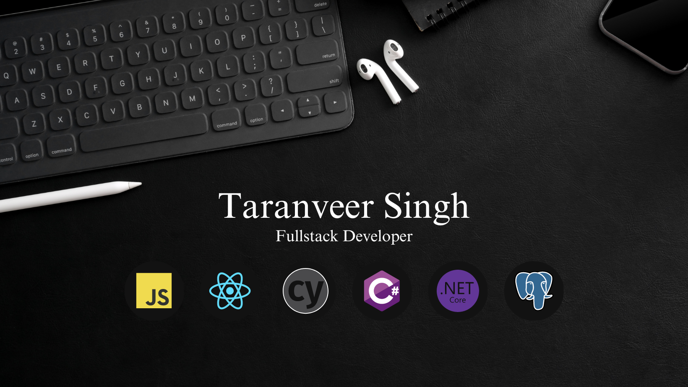

### Tech Stack

![javascript]
![typescript]
![bootstrap]
![react]
![aspNet]
![csharp]
![graphql]
![cypress]
![aws]
![postgres]
![mocha]
![chai]
![jest]
![nodejs]
![express]
![git]
![npm]

### About Me

Hey! I'm Taranveer. I can work on code all day everyday and log documentation wherever needed.

I’ve always been a doting problem solver with predictable consistency. I have created frontend projects with Javascript/React and have created backend projects with C# .NET MVC. While familiar with a variety of programming languages, I’m happy to learn more to be considered of value to your team.

[bootstrap]: https://img.shields.io/badge/Bootstrap%20-%20black?style=for-the-badge&logo=bootstrap&logoColor=white&color=%237952B3
[aspNet]: https://img.shields.io/badge/ASP.NET%20MVC%20-%20black?style=for-the-badge&logo=dotnet&logoColor=white&color=%23512bd4
[csharp]: https://img.shields.io/badge/C%23%20-%20black?style=for-the-badge&logo=csharp&logoColor=white&color=%23512BD4
[javascript]: https://img.shields.io/badge/Javascript-grey?style=for-the-badge&logo=javascript
[react]: https://img.shields.io/badge/React-black?style=for-the-badge&logo=react&color=%230C2451
[graphql]: https://img.shields.io/badge/GraphQl-E10098?style=for-the-badge&logo=graphql&logoColor=white
[typescript]: https://img.shields.io/badge/typescript-%23007ACC.svg?style=for-the-badge&logo=typescript&logoColor=white
[cypress]: https://img.shields.io/badge/-cypress-%23E5E5E5?style=for-the-badge&logo=cypress&logoColor=058a5e
[aws]: https://img.shields.io/badge/Amazon_AWS-232F3E?style=for-the-badge&logo=amazon-aws&logoColor=white
[postgres]: https://img.shields.io/badge/PostgreSQL-316192?style=for-the-badge&logo=postgresql&logoColor=white
[mocha]: https://img.shields.io/badge/mocha.js-323330?style=for-the-badge&logo=mocha&logoColor=Brown
[chai]: https://img.shields.io/badge/chai.js-323330?style=for-the-badge&logo=chai&logoColor=red
[jest]: https://img.shields.io/badge/Jest-323330?style=for-the-badge&logo=Jest&logoColor=white
[nodejs]: https://img.shields.io/badge/Node%20js-339933?style=for-the-badge&logo=nodedotjs&logoColor=white
[express]: https://img.shields.io/badge/Express.js-404D59?style=for-the-badge
[git]: https://img.shields.io/badge/GIT-E44C30?style=for-the-badge&logo=git&logoColor=white
[npm]: https://img.shields.io/badge/npm-CB3837?style=for-the-badge&logo=npm&logoColor=white
